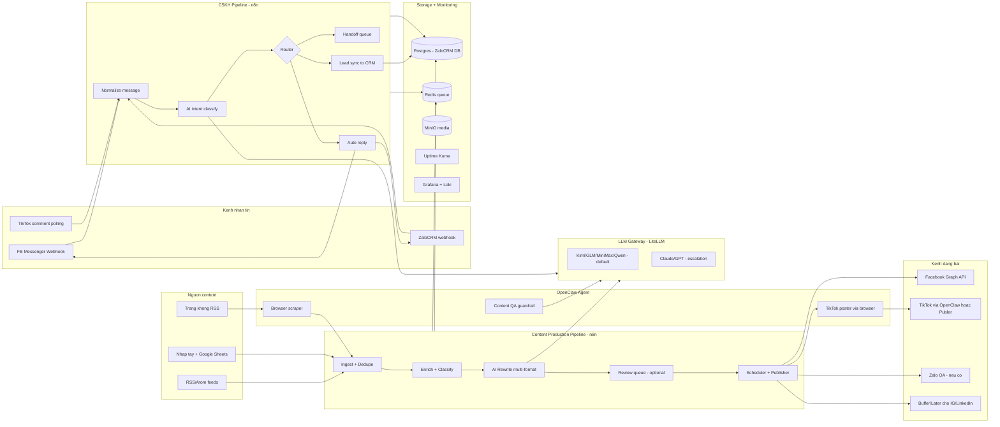

# Kế hoạch triển khai: Hệ thống Content Automation + Bot CSKH Đa kênh

## 1. Tóm tắt giải pháp khuyến nghị

- **Lựa chọn kiến trúc chính**: n8n làm orchestration lõi (deterministic workflow, queue, cron, retry), ZaloCRM hiện có làm Zalo channel hub + conversation store + mini-CRM, OpenClaw làm lớp agent cho các tác vụ bán cấu trúc (scrape web khó, duyệt nội dung, thao tác browser đăng TikTok, fallback human-like). LLM chạy qua một gateway abstraction (khuyến nghị LiteLLM self-host hoặc OpenRouter) để swap model dễ, mặc định dùng model rẻ (Kimi, GLM-4, MiniMax, Qwen, Gemini Flash), chỉ escalate lên Claude/GPT cho các node quan trọng.
- **ZaloCRM là tài sản mạnh nhất**: đã xử lý xong phần khó nhất của Zalo cá nhân (QR pool, session persist, auto-reconnect với circuit breaker 5 disconnect/5 phút tại [backend/src/modules/zalo/zalo-pool.ts](ZaloCRM/backend/src/modules/zalo/zalo-pool.ts), selfListen dedup, rate limit 200 tin/ngày). Public API + webhook HMAC đã sẵn ở [backend/src/modules/api/public-api-routes.ts](ZaloCRM/backend/src/modules/api/public-api-routes.ts) và [backend/src/modules/api/webhook-service.ts](ZaloCRM/backend/src/modules/api/webhook-service.ts). Không xây lại, chỉ mở rộng.
- **Kênh nào xử lý ở đâu**: Zalo → ZaloCRM (webhook out → n8n → AI → public API send). Facebook Messenger → Graph API webhook trực tiếp vào n8n. TikTok DM → không tự động hoá hội thoại (policy rủi ro), chỉ bot comment reply qua TikTok API. Publishing content: Facebook qua Graph API trong n8n, TikTok qua OpenClaw agent browser hoặc Publer/Ayrshare (MoR), Zalo OA (nếu có) qua API chính thức.
- **Phương án thay thế** (chỉ dùng khi điều kiện cụ thể):
  - Thay Buffer/Later bằng **Publer** hoặc **Ayrshare** nếu cần TikTok publishing qua API ổn định (Buffer/Later không hỗ trợ TikTok video upload tự động tốt).
  - Thay LiteLLM bằng **OpenRouter** nếu không muốn self-host gateway (trade-off: phí 5% markup đổi lấy 0 ops).
  - Dùng **Typebot/Chatwoot** thay cho ZaloCRM nếu sau này cần omnichannel inbox UI đầy đủ — nhưng ZaloCRM đã bao phủ 80% nhu cầu cho kênh Zalo nên không nên thay ở Phase 1-2.

---

## 2. Kiến trúc tổng thể

### 2.1 Sơ đồ logic



### 2.2 Vai trò của từng công cụ

- **n8n (self-host Docker)** — orchestration lõi. Chạy deterministic workflow: cron ingest, fan-out rewrite, webhook router, retry logic. KHÔNG dùng cho agentic/fuzzy task.
- **ZaloCRM (hiện có)** — hub kênh Zalo cá nhân: QR pool, session persist, conversation + contact + appointment store, rate limiter 200 tin/ngày, webhook out khi có message/contact/connect event, public REST API để n8n gọi send message. Xem schema tại [backend/prisma/schema.prisma](ZaloCRM/backend/prisma/schema.prisma). Ở Phase 1, tận dụng luôn bảng `Contact.source` để phân biệt FB/TT/Zalo thay vì xây CRM mới.
- **OpenClaw (self-host)** — lớp agent cho các việc n8n không làm tốt: (1) browser-scrape trang không có RSS/structured API, (2) đăng TikTok video qua browser automation khi Publer không khả dụng, (3) content QA guardrail (kiểm policy, check plagiarism, tone), (4) human-in-the-loop fallback khi intent confidence thấp. KHÔNG để OpenClaw làm orchestration lõi.
- **LLM Gateway — LiteLLM self-host** (khuyến nghị chính) hoặc OpenRouter (nếu muốn zero-ops): abstract provider, giữ một endpoint OpenAI-compatible duy nhất cho mọi node AI. Cho phép swap model mà không sửa workflow. Hiện ZaloCRM đã có multi-provider registry tương tự tại [backend/src/modules/ai/provider-registry.ts](ZaloCRM/backend/src/modules/ai/provider-registry.ts) và [backend/src/modules/ai/providers/openai-compat.ts](ZaloCRM/backend/src/modules/ai/providers/openai-compat.ts) — tái sử dụng pattern này cho cả n8n.
- **Facebook Graph API** — publishing Page post, nhận webhook Messenger. Chính thức, ổn định nhất. KHÔNG dùng workaround FB.
- **TikTok** — 2 chế độ: (a) official Business API cho publishing video và reply comment nếu được approve (khó và chậm); (b) OpenClaw browser agent cho tài khoản cá nhân/creator (rủi ro ban, chỉ cho volume thấp). KHÔNG nên auto DM TikTok.
- **Buffer/Later** — cân nhắc lại. Buffer có tier miễn phí tốt cho FB/LinkedIn/IG nhưng TikTok hỗ trợ yếu. Khuyến nghị: giữ Buffer cho FB/LinkedIn/IG, dùng Publer ($12/tháng) hoặc OpenClaw agent cho TikTok.
- **PostgreSQL 16** — đã có sẵn trong ZaloCRM stack ([docker-compose.yml](ZaloCRM/docker-compose.yml)), tái sử dụng cho cả n8n DB (schema riêng) và content DB.
- **Redis + BullMQ** — thêm mới. Queue cho các tác vụ AI chậm, rate limiting ngoài Zalo 200 msg/day (hiện đã có in-memory tại [backend/src/modules/zalo/zalo-rate-limiter.ts](ZaloCRM/backend/src/modules/zalo/zalo-rate-limiter.ts) — nên upgrade lên Redis khi scale multi-instance).
- **MinIO self-host hoặc Cloudflare R2** — media storage cho ảnh/video content.
- **Uptime Kuma + Grafana Loki** — monitoring/logging. Uptime Kuma free, dễ setup, ping health endpoint [/health](ZaloCRM/backend/src/app.ts) có sẵn ở ZaloCRM.
- **Google Sheets/Airtable** — content editorial calendar + lead overflow cho đội Sales đọc dễ (đã có integration google_sheets tại [backend/src/modules/integrations/providers/google-sheets.ts](ZaloCRM/backend/src/modules/integrations/providers/google-sheets.ts)).

### 2.3 Phân lớp trách nhiệm

- **Orchestration layer**: n8n duy nhất. Không để OpenClaw/ZaloCRM automation engine gánh vai trò này.
- **AI layer**: LiteLLM gateway → (Kimi/GLM/MiniMax/Qwen/Gemini Flash default) → escalation Claude/GPT.
- **Channel layer**: Zalo qua ZaloCRM API; Facebook qua Graph API trực tiếp; TikTok qua OpenClaw/Publer.
- **Storage layer**: Postgres (OLTP), Redis (queue/cache), MinIO/R2 (media), Google Sheets (editorial view).
- **CRM/Lead layer**: ZaloCRM `Contact` bảng đã multi-tenant và multi-source sẵn. Giữ nguyên, tagging source=`FB|TT|Zalo|Manual`.
- **Monitoring layer**: Uptime Kuma (up/down), Loki (logs), webhook [message.received/sent/contact.created](ZaloCRM/README.md) → n8n để log sự kiện vào Grafana.

---

## 3. Thiết kế workflow Content Production

### 3.1 Các bước

1. **Ingest** (n8n cron mỗi 15–60 phút):
   - RSS/Atom feeds: dùng n8n RSS Feed node.
   - Trang không có RSS: gọi OpenClaw skill `scrape_article(url, selectors)` trả về JSON { title, body, image, publishedAt, canonicalUrl }.
   - Manual: Google Sheets node đọc sheet "Content Inbox".
2. **Dedupe + làm sạch**:
   - Hash `canonicalUrl` hoặc `SHA-256(title + first 200 chars)` → lưu vào Postgres bảng mới `content_seen(hash, source, firstSeenAt)` với UNIQUE index.
   - Loại tin trùng, tin quá ngắn (<300 ký tự), tin có từ khoá blacklist (config).
3. **Enrich + classify** (LLM rẻ, ví dụ Kimi/GLM-4-Flash):
   - Output JSON: `{topic, tone, audience, keypoints[], factualityScore, brandFit}`.
   - Cắt ngay nếu `brandFit < 0.5` hoặc `factualityScore < 0.4`.
4. **AI rewrite multi-format** (fan-out theo platform):
   - Một prompt template per platform, tất cả gọi chung LiteLLM gateway:
     - Facebook post: 150–500 ký tự, hook + CTA + 3 hashtag.
     - Zalo post/broadcast: 80–200 ký tự, formal tone, không hashtag.
     - TikTok caption: <150 ký tự, 1 hook + 3–5 hashtag trend.
     - LinkedIn: 600–1200 ký tự, professional.
   - Lưu tất cả version vào bảng `content_drafts(id, sourceId, platform, body, status, scheduledAt)`.
5. **Review queue** (optional nhưng khuyến nghị ở Phase 1):
   - Nếu `brandFit > 0.8 và factualityScore > 0.7 và không chạm blacklist` → auto-approve.
   - Ngược lại → đẩy vào Google Sheets "Review Queue" với deep-link, đội content duyệt.
   - OpenClaw QA skill chạy parallel: check policy (spam, nhạy cảm, trùng), trả về `qaStatus`.
6. **Scheduler**:
   - n8n cron đọc `content_drafts WHERE status='approved' AND scheduledAt<=now()` mỗi phút.
   - Publish theo platform:
     - Facebook: Graph API `/{page-id}/feed` (text+link) hoặc `/photos` (ảnh) hoặc `/videos` (video). Access token lưu mã hoá.
     - Zalo OA: chỉ nếu có OA chính thức (Zalo cá nhân KHÔNG được phép broadcast qua zca-js — rủi ro ban cao, không dùng cho publishing).
     - TikTok: Publer API (nếu có account) hoặc OpenClaw skill `tiktok_post(caption, videoPath)`.
     - Buffer: HTTP API POST để schedule đồng loạt IG/LinkedIn.
7. **Error handling**:
   - Retry 3 lần với backoff 30s/5min/30min.
   - Mỗi lỗi ghi vào `content_publish_log(draftId, platform, status, error, attemptedAt)`.
   - Alert Telegram channel khi fail >3 lần hoặc khi `access_token_expired`.
8. **Logging + analytics**:
   - n8n webhook mỗi post thành công → ghi `{platform, postId, postedAt, draftId}` về Postgres.
   - Hàng ngày, n8n cron gọi Graph API `insights` / TikTok analytics → cập nhật `content_metrics(postId, reach, engagement, clicks)`.
   - Dashboard Grafana hoặc Metabase đọc Postgres trực tiếp.

### 3.2 Platform-specific guardrails

- **Facebook**: không post link quá thường xuyên (giảm reach), giữ khoảng cách ≥30 phút giữa 2 post cùng Page.
- **TikTok**: không post quá 3 video/ngày/account, caption không chứa từ cấm.
- **Zalo OA**: giới hạn 4 broadcast/tháng miễn phí (policy Zalo OA). Nếu dùng tài khoản cá nhân qua zca-js → **chỉ dùng để reply chứ KHÔNG broadcast**.

---

## 4. Thiết kế bot CSKH đa kênh

### 4.1 Ingest message

- **Zalo**: ZaloCRM listener [attachZaloListener](ZaloCRM/backend/src/modules/zalo/zalo-listener-factory.ts) gọi `handleIncomingMessage` → webhook out sự kiện `message.received` (đã có HMAC signature) → n8n endpoint `/webhook/zalo-inbound`.
- **Facebook Messenger**: đăng ký Messenger webhook ở Meta App. n8n webhook `/webhook/fb-inbound` nhận `messaging` event. Verify `X-Hub-Signature-256` bằng App Secret.
- **TikTok**: KHÔNG có webhook DM public. Chỉ xử lý comment qua TikTok Display/Business API bằng polling cron mỗi 5 phút `GET /v2/video/comment/list`. DM tự động bằng workaround → rủi ro ban, KHÔNG làm.

### 4.2 Normalize → 1 schema chung trong n8n

```
{
  channel: 'zalo'|'fb'|'tiktok',
  externalUserId, userName, avatar,
  threadId, messageId, text, contentType,
  receivedAt, rawPayload
}
```

### 4.3 AI intent classify

- LLM rẻ (Kimi/GLM) với prompt structured output:
  - `intent ∈ {greeting, pricing, product_info, complaint, booking, smalltalk, spam, other}`
  - `leadScore 0-100`, `urgency low|normal|high`, `language vi|en`.
- Cache intent theo hash message trong Redis 24h để tiết kiệm token.
- Confidence thresholds:
  - `>= 0.85` → auto-reply được phép.
  - `0.6–0.85` → auto-reply "chờ tư vấn viên" + đẩy vào Handoff.
  - `< 0.6` → chỉ đẩy Handoff, không tự trả lời.

### 4.4 Policy trả lời

- **Bot được phép reply khi**:
  - Confidence ≥ threshold VÀ intent thuộc whitelist (greeting, pricing, product_info, booking).
  - Trong giờ hành chính HOẶC intent=greeting ngoài giờ.
  - Chưa có staff trả lời trong 5 phút (kiểm tra `Conversation.isReplied`).
- **Chuyển người thật khi**:
  - Intent = complaint hoặc urgency = high.
  - Customer gõ từ khoá escalation: "gặp người", "nhân viên", "bực quá", "report".
  - >3 lượt bot reply mà customer vẫn chưa thoả mãn (đo bằng sentiment AI tại [backend/src/modules/ai/prompts/sentiment.ts](ZaloCRM/backend/src/modules/ai/prompts/sentiment.ts)).

### 4.5 Handoff + lead sync

- Handoff: n8n cập nhật `Conversation.isReplied=false`, tag `needs_human`, emit socket event → dashboard ZaloCRM hiện badge.
- Lead qualified (leadScore ≥ 70 và intent = pricing|booking): n8n gọi `POST /api/public/contacts` với source=channel, tags=['hot_lead'], đồng thời `POST /api/public/appointments` nếu có lịch hẹn được detect.
- Đội Sales nhận notification: Telegram bot channel `#sales-hot-leads` + email.

### 4.6 Lưu lịch sử + error handling

- Hội thoại Zalo đã auto-persist vào `Message` table (schema hiện có, unique index `(conversationId, zaloMsgId)` chống trùng tại [schema.prisma line 198](ZaloCRM/backend/prisma/schema.prisma)).
- Facebook/TikTok: thêm bảng mới `external_conversations` và `external_messages` với cùng pattern, hoặc đơn giản hơn → tái sử dụng `Conversation` với `threadType='fb'|'tiktok'` và bỏ FK `zaloAccountId` bắt buộc (cần sửa nhỏ schema).
- Timeout: n8n node HTTP có `timeout=10s`, retry 2 lần. Nếu LLM fail → fallback "Cảm ơn bạn, tư vấn viên sẽ liên hệ ngay" + handoff.
- Dedup: dùng `externalMessageId` làm key + Redis SETNX 5 phút để chặn webhook trùng.

---

## 5. Roadmap triển khai theo phase

### Phase 1 — MVP ra nhanh (1-2 tuần)

- **Mục tiêu**: 1 workflow content đầy đủ cho Facebook + 1 bot CSKH Zalo tự trả lời FAQ.
- **Việc cần làm**:
  1. Deploy stack Docker: ZaloCRM (đã có), thêm n8n, Redis, LiteLLM trong cùng `docker-compose`.
  2. Cấu hình LiteLLM với 2 provider rẻ: Kimi + Gemini Flash (miễn phí ở tier thấp).
  3. Tạo API key cho n8n gọi ZaloCRM public API; cấu hình `webhook_url` trong `app_settings` trỏ về n8n.
  4. Content workflow v1: RSS → dedupe → rewrite cho Facebook → đẩy vào Google Sheets "Approved" → n8n cron đọc sheet → Graph API post.
  5. CSKH workflow v1: ZaloCRM webhook `message.received` → n8n → intent classify (Kimi) → nếu FAQ đơn giản → gọi public API send message → ngược lại mark `needs_human`.
  6. Uptime Kuma ping health của n8n + ZaloCRM + Postgres.
- **Phụ thuộc**: Facebook App đã approved cho Pages + Messenger scope; 1 Zalo account đã login QR trong ZaloCRM; LLM API key.
- **Output**: 5-10 post/ngày trên 1 Facebook Page + bot Zalo trả lời FAQ ≥50% câu hỏi mà không cần người.
- **Rủi ro chính**: Facebook App review chậm (2-4 tuần) — giảm bằng cách dùng Development mode với vài tester trước; zca-js bị Zalo khoá account — giảm bằng chế độ đọc nhiều hơn gửi, giữ dưới 200 tin/ngày (rate limit đã có tại [zalo-rate-limiter.ts](ZaloCRM/backend/src/modules/zalo/zalo-rate-limiter.ts)).

### Phase 2 — Mở rộng kênh + review pipeline (2-4 tuần)

- **Mục tiêu**: thêm Facebook Messenger inbound + TikTok comment + editorial review + multi-format rewrite.
- **Việc cần làm**:
  1. Meta App đầy đủ permission: `pages_messaging`, `pages_manage_posts`, `pages_read_engagement`. Webhook Messenger vào n8n.
  2. TikTok Business API: đăng ký developer, xin permission `video.publish` + `comment.list`. Nếu không được duyệt nhanh → OpenClaw agent browser fallback cho post.
  3. Fan-out rewrite: thêm branch cho Zalo/TikTok/LinkedIn trong content workflow.
  4. Review queue Google Sheets hoàn chỉnh: cột Approve/Reject/Edit, n8n đọc trạng thái mỗi 5 phút.
  5. OpenClaw skill `content_qa`: check policy, check plagiarism qua API Copyleaks/Originality.ai (optional).
  6. Nâng automation rule trong ZaloCRM ([automation-service.ts](ZaloCRM/backend/src/modules/automation/automation-service.ts)) thêm action mới `call_webhook(url, payload)` để ZaloCRM có thể trigger n8n workflow trực tiếp từ DB rule (hiện chỉ có 4 action: assign_user/update_status/create_appointment/send_template).
- **Phụ thuộc**: App review, Publer subscription (nếu dùng), OpenClaw đã cài skill tiktok-poster.
- **Output**: 3 kênh publish + 3 kênh CSKH inbound hoạt động với auto-reply + lead sync.
- **Rủi ro chính**: TikTok API từ chối permission → fallback browser agent rủi ro ban; review queue bị ứ đọng → cần SLA 2h cho biên tập.

### Phase 3 — Tối ưu, đo lường, scale (ongoing)

- **Mục tiêu**: bền, rẻ, đo được.
- **Việc cần làm**:
  1. Grafana dashboard: cost per 1K token per provider, publish success rate, auto-reply rate, lead conversion.
  2. A/B test prompt: 2 variant prompt per platform, đo CTR.
  3. Chuyển Zalo rate limiter từ in-memory lên Redis để scale horizontal.
  4. Nâng CRM: khi Contact vượt 50K → thêm bảng `LeadActivity` riêng, hoặc export sang HubSpot Free.
  5. Cost optimization: cache intent classification (Redis TTL 24h), batch rewrite (fan-in 5 article cùng lúc), chuyển LLM rẻ hơn khi chất lượng đủ.
  6. Disaster recovery: test restore backup Postgres hàng tuần (đã có `prodrigestivill/postgres-backup-local` trong [docker-compose.yml](ZaloCRM/docker-compose.yml)).
- **Output**: chi phí LLM giảm 30-50% vs Phase 2, uptime >99.5%, lead conversion đo được.
- **Rủi ro chính**: cost drift do prompt growth — giảm bằng monthly review + alert khi vượt budget.

---

## 6. Công nghệ tối ưu cho từng phần

- **Orchestration**: n8n self-host. Lý do: workflow visual, có queue mode, retry sẵn, cộng đồng lớn, chi phí 0. Thay thế: Temporal (phức tạp hơn, chỉ cần khi >10K jobs/ngày), Windmill (nhanh hơn nhưng cộng đồng nhỏ).
- **Agent**: OpenClaw cho tác vụ bán cấu trúc. Khi nào dùng n8n thay OpenClaw: workflow có API rõ ràng, deterministic. Khi nào dùng OpenClaw: browser, decision mờ, human-like action.
- **LLM gateway**: LiteLLM self-host (khuyến nghị) > OpenRouter. LiteLLM miễn phí, toàn quyền, có budget tracking built-in. OpenRouter thu 5% markup đổi lấy 0 ops.
- **LLM model mặc định**:
  - Intent classify + enrich: Kimi-k2 hoặc GLM-4-Flash (~0.1 USD/1M token input) — rẻ nhất chất lượng đủ VN.
  - Content rewrite: Qwen-Plus hoặc MiniMax-Text-01 — tiếng Việt tốt.
  - Sentiment/guardrail: Gemini-1.5-Flash (free tier 15 RPM).
  - Escalation cho complaint/VIP: Claude Sonnet hoặc GPT-4o Mini.
- **Database**: Postgres 16 (đã có). Thay thế: chỉ cần đổi khi >500GB hoặc cần sharding — không cần ở 2026.
- **Queue**: Redis + BullMQ. Thay thế: n8n queue mode (Redis backed) — dùng cùng Redis luôn.
- **Media storage**: MinIO self-host (nếu on-prem) hoặc Cloudflare R2 ($0.015/GB, egress miễn phí). R2 tốt hơn cho CDN TikTok/FB video.
- **Publishing**: Buffer (FB/IG/LinkedIn free tier 3 channel) + Publer ($12/th TikTok) hoặc OpenClaw agent. Later cũng tốt nhưng Buffer tier free rộng hơn.
- **Monitoring**: Uptime Kuma (free, self-host) + Grafana Loki (free, log aggregation). Thay thế SaaS: Better Stack, Datadog — đắt không cần thiết Phase 1-2.
- **CRM**: Giữ ZaloCRM `Contact` bảng. Chỉ chuyển sang HubSpot/Zoho khi vượt 50K lead hoặc cần sale pipeline nhiều stage phức tạp.

---

## 7. MVP vs Production-ready

### MVP (Phase 1 output)

- 1 `docker-compose.yml` chạy: ZaloCRM + n8n + Redis + LiteLLM + Postgres + Uptime Kuma.
- 1 Zalo account đã login QR, webhook bật.
- 1 Facebook Page đã connect (chế độ Dev cũng được).
- 1 workflow content hoàn chỉnh: RSS → dedupe → rewrite FB → Sheets approve → post FB.
- 1 workflow CSKH Zalo: inbound webhook → intent → auto-reply FAQ hoặc handoff.
- LiteLLM chỉ cần 1 key Kimi hoặc Gemini Flash là chạy được.
- Log cơ bản: n8n execution list + Postgres `content_publish_log`.

### Production-ready (Phase 2-3 output)

- 3 kênh publish (FB/TikTok/LinkedIn hoặc Zalo OA nếu có).
- 3 kênh CSKH (Zalo + FB Messenger + TikTok comment).
- Review queue có SLA, notify Telegram.
- Multi-format rewrite với guardrail QA.
- Cost tracking + budget alert.
- Backup automated + restore test tuần.
- Rate limiter Redis-backed.
- Grafana dashboard + alert rule.
- HMAC signature verify mọi webhook inbound.
- Secret rotation quy trình.

### Từ MVP lên Production cần thêm

- Meta App review approved.
- Publer/TikTok API approved hoặc OpenClaw TikTok skill ổn định.
- Redis queue + BullMQ worker process.
- Cost tracking (LiteLLM built-in + Grafana).
- Alerting Telegram/email channel.
- Secret manager (1Password Connect hoặc HashiCorp Vault lite).
- Load test: k6 script cho 1000 concurrent webhook.

---

## 8. Rủi ro, giới hạn, lưu ý triển khai

- **[QUAN TRỌNG] zca-js = unofficial**: Zalo có thể khóa account cá nhân bất kỳ lúc nào. Giảm rủi ro:
  - Giữ dưới 200 msg/day (đã có rate limiter).
  - Dùng proxy per-account ([README v2.0](ZaloCRM/README.md) đã hỗ trợ).
  - Không dùng để broadcast/marketing — chỉ reply CSKH.
  - Luôn có nhiều Zalo account backup.
- **[QUAN TRỌNG] Facebook policy**: App review bắt buộc cho production. `pages_messaging` cần use case rõ ràng. Không spam, phải có privacy policy. 24h window rule: chỉ reply trong 24h sau message cuối của user (trừ khi dùng message tag hợp lệ).
- **[QUAN TRỌNG] TikTok**: API DM không public. Auto DM qua workaround = ban chắc. Auto comment reply nếu volume cao cũng có nguy cơ. Publish video qua official API cần business verification.
- **Official API vs workaround**:
  - Dùng official: Facebook Graph, Meta Messenger, TikTok Business, Zalo OA, Google Sheets.
  - Dùng workaround (có rủi ro): zca-js cho Zalo cá nhân, OpenClaw browser cho TikTok post. Chấp nhận rủi ro vì không có alternative.
- **Lỗi triển khai phổ biến**:
  - Webhook không verify signature → spoofing.
  - LLM prompt không có guardrail output → inject/jailbreak.
  - Quên rate limit → bị ban provider.
  - Secret commit vào git.
  - Không dedupe webhook → spam user với cùng reply.
  - n8n execution data queue quá lớn → Postgres chậm (giải pháp: set `EXECUTIONS_DATA_MAX_AGE=72h` và prune).
- **Giảm rủi ro tổng thể**:
  - Feature flag cho auto-reply (tắt nhanh được).
  - Shadow mode: bot soạn reply nhưng không gửi, staff review vài ngày đầu.
  - Circuit breaker tự động tắt auto-reply khi error rate >10% (ZaloCRM đã có pattern circuit breaker tại [zalo-pool.ts line 192](ZaloCRM/backend/src/modules/zalo/zalo-pool.ts)).

---

## 9. Checklist triển khai (KPI + danh sách việc)

### KPI thành công

- **Tốc độ xử lý**: webhook → reply P50 < 3s, P95 < 10s.
- **Publish success rate**: ≥ 98% (tính trên retry cuối cùng).
- **Intent classification accuracy**: ≥ 85% (đo bằng sample 200 hội thoại/tuần, staff label).
- **Auto-reply success rate** (bot xử lý không cần người): ≥ 60% Phase 1, ≥ 75% Phase 3.
- **Lead routing accuracy** (lead qualified đúng được đẩy sang Sales): ≥ 90%.
- **Human handoff rate**: 20–40% là healthy. <20% nghi auto-reply quá tự tin. >50% là bot chưa đủ tốt.
- **Uptime**: ≥ 99.5%.
- **Cost LLM/lead**: < 500 VND/lead (với model rẻ).

### Checklist MVP

- [ ] Docker Compose dựng được toàn stack trên 1 VPS 4GB RAM.
- [ ] ZaloCRM webhook_url đã trỏ về n8n và có webhook_secret.
- [ ] LiteLLM chạy, có ít nhất 1 provider rẻ hoạt động.
- [ ] n8n workflow content: ingest RSS → rewrite → post FB thành công ≥3 post.
- [ ] n8n workflow CSKH: test với 20 câu hỏi FAQ, ≥12 câu auto-reply đúng.
- [ ] Uptime Kuma ping 3 service, alert Telegram khi down.
- [ ] Backup Postgres chạy daily, test restore 1 lần.
- [ ] Secret không nằm trong git, dùng `.env` + `.gitignore`.
- [ ] Rate limiter Zalo 200/day vẫn active.
- [ ] Tài liệu runbook: cách restart, cách thêm Zalo account, cách đổi LLM provider.

---

## 10. Kết luận — nên làm ngay

- **Bắt đầu Phase 1 với 4 bước**:
  1. Mở rộng [docker-compose.yml](ZaloCRM/docker-compose.yml) hiện có: thêm service `n8n`, `redis`, `litellm`. Giữ Postgres chung (schema riêng cho n8n).
  2. Thiết lập LiteLLM với Kimi + Gemini Flash. Xác nhận cost <100K VND/tháng ở baseline.
  3. Cấu hình webhook_url trong ZaloCRM `app_settings` trỏ về `https://n8n.yourdomain/webhook/zalo-inbound` + webhook_secret. Kiểm tra HMAC ở [webhook-service.ts](ZaloCRM/backend/src/modules/api/webhook-service.ts).
  4. Build 2 workflow n8n mẫu (content + CSKH) và chạy 1 tuần shadow mode trước khi bật auto-reply.
- **Không nên làm ở Phase 1**: TikTok publishing, multi-format fan-out đầy đủ, HubSpot migration, OpenClaw agent browser cho TikTok. Đây đều là Phase 2+.
- **Điểm mạnh bền**: ZaloCRM đã xử lý 80% rủi ro kỹ thuật khó nhất (Zalo session, dedup, rate limit, multi-tenant). Tập trung effort vào n8n workflow và prompt engineering — đây là nơi tạo giá trị nhanh nhất.
