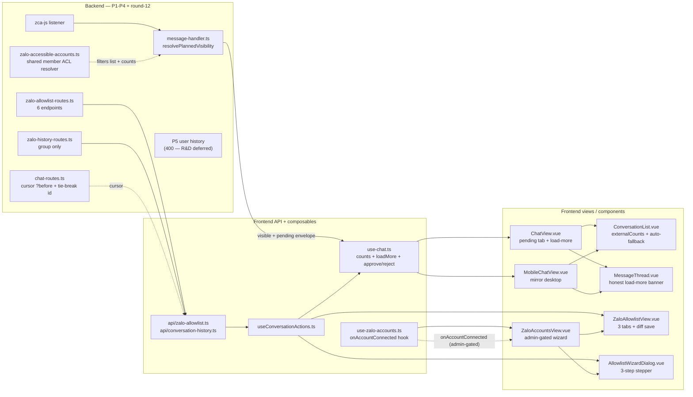

# Hoàn thiện và cải tiến ZaloCRM

## 1. Trạng thái hiện tại so với các plan

**Đã triển khai đúng (xác nhận qua đọc code):**
- P1 schema — [backend/prisma/schema.prisma](backend/prisma/schema.prisma) có `Conversation.visibility/hiddenAt/reviewedAt/oldestMessageAt/historyExhausted`, `ZaloAccount.ingestPolicy`, bảng `ZaloThreadAllowlist`, index `[orgId, visibility, lastMessageAt]`. Migration `20260422184100_add_conversation_visibility_and_allowlist/` idempotent, default `'visible'` + `'all'` preserve v2.1.
- P2 enforcement — [backend/src/modules/chat/message-handler.ts](backend/src/modules/chat/message-handler.ts) có `resolvePlannedVisibility()` gate đủ 3 side-effects (contact.created webhook, message webhook, automation) trước mọi DB write; [backend/src/modules/zalo/zalo-allowlist-cache.ts](backend/src/modules/zalo/zalo-allowlist-cache.ts) TTL 60s + fail-open, counts endpoint thêm field `pending`.
- P3 CRUD API — [backend/src/modules/zalo/zalo-allowlist-routes.ts](backend/src/modules/zalo/zalo-allowlist-routes.ts) đủ 6 endpoint (list + patch-policy + bulk + approve + reject + available-threads), idempotent upsert, bulk cascade revoke → `hidden`, org-scope re-check để owner/admin không cross-org. Cache invalidation wired cả `invalidateAllowlistCache` lẫn `invalidateThreadListingCache` đầy đủ 5 mutation paths.
- P4 group history — [backend/src/modules/zalo/zalo-history-routes.ts](backend/src/modules/zalo/zalo-history-routes.ts) + `fetchAndPersistGroupBatch` trong [backend/src/modules/zalo/zalo-message-sync.ts](backend/src/modules/zalo/zalo-message-sync.ts); `historyExhausted` chỉ set khi upstream `more=false`, user thread trả 400 chờ P5.
- 9 vòng Codex-followup đã close: socket JWT auth + account-room ACL parity (thay vì org room), visibility contract end-to-end cho REST/Socket/Public API, pending envelope scrub chỉ `{accountId, visibility}`, ADR-001 giải thích default `'all'`, 12-assertion contract smoke shell script với live-send guard (`ALLOW_LIVE_SEND=1`).

**Đã triển khai trong round 11 (M1 + M2 frontend/docs):**
- **P6 Allowlist Management UI** — [frontend/src/views/ZaloAllowlistView.vue](frontend/src/views/ZaloAllowlistView.vue) với 3 tabs friends/groups/pending, route `/zalo-accounts/:id/allowlist`, API client [frontend/src/api/zalo-allowlist.ts](frontend/src/api/zalo-allowlist.ts).
- **P7 ChatView pending tab + load-more** — tab "Chờ duyệt (N)" conditional trong [frontend/src/components/chat/ConversationList.vue](frontend/src/components/chat/ConversationList.vue), banner load-more trong [frontend/src/components/chat/MessageThread.vue](frontend/src/components/chat/MessageThread.vue) với UX copy 3-state (moreUpstream flag), scroll preserve. [frontend/src/composables/use-chat.ts](frontend/src/composables/use-chat.ts) đã có `fetchCounts`, `loadMoreLocal`, `fetchHistoryFromZalo`, `approveConv`, `rejectConv`.
- **P8 Wizard sau QR** — [frontend/src/components/zalo/AllowlistWizardDialog.vue](frontend/src/components/zalo/AllowlistWizardDialog.vue) 3-step stepper; hook `onAccountConnected` trong [frontend/src/composables/use-zalo-accounts.ts](frontend/src/composables/use-zalo-accounts.ts) (không thêm listener trong view); `ZaloAccountsView.vue` auto-open wizard cho account mới với localStorage flag.
- **P9 Docs** — [docs/feature-conversation-allowlist.md](docs/feature-conversation-allowlist.md), [docs/feature-chat-history-fetch.md](docs/feature-chat-history-fetch.md), [docs/migration-v2.1-to-v2.2.md](docs/migration-v2.1-to-v2.2.md), README section v2.2, HUONG-DAN-SU-DUNG section "Quản lý hội thoại".

**Round 12 Codex fixes (đã áp dụng sau round 11 review):**
- **P2 #1** Cursor composite tie-break — `chat-routes.ts` cursor query thêm `id` tiebreaker để không skip tin cùng timestamp với pivot.
- **P2 #2** Counts lift — counts từ `use-chat` giờ pass-through prop xuống ConversationList; socket pending envelope refresh → tab pending hiện realtime.
- **P2 #3** ACL resolver — [backend/src/modules/zalo/zalo-accessible-accounts.ts](backend/src/modules/zalo/zalo-accessible-accounts.ts) mới, share giữa chat list + counts, bao gồm `ownerUserId` fallback (parity với `requireZaloAccess`).
- **P2 #4** Wizard permission — button + auto-open gate bằng `authStore.isAdmin` để member-chat không bị 403.
- **P3** Plan refresh — frontmatter + section này.

**Round 13 Codex fixes (đã áp dụng sau round 12 review):**
- **P3 #1** Pending tab stranded — `ConversationList` watcher tự động fallback `activeTab='main'` khi `counts.pending` về 0 mà tab đang là 'pending'. Không còn filter rỗng kẹt trên tab đã biến mất.
- **P3 #2** Plan diagram refresh — mermaid section 2 giờ phản ánh đúng state M1 shipped + round-12 components (thay vì "CHƯA CÓ").

**Round 13 M4a Tooling minimum (đã ship trong cùng round):**
- Remove `jsonwebtoken` + `@types/jsonwebtoken` dead dep khỏi `backend/package.json`. `npm install` báo "removed 11 packages" (deps transitive tự clean).
- Thêm `.nvmrc = 20` ở root để `nvm use` tự align Node version cho dev team (match `node:20-alpine` trong `docker-compose.yml`).
- Thêm `engines: { node: '>=20' }` trong cả BE + FE `package.json`. Cố ý dùng `>=20` thay vì `<21` để không block dev đang chạy Node 22 cục bộ; container production đã pin Node 20.
- Thêm `typecheck` script chạy `tsc --noEmit` (BE) / `vue-tsc --noEmit` (FE) để dev + CI có single entrypoint thay vì gọi `npx` thủ công.

**Còn lại (backlog tiếp theo):**
- **M3 P5 R&D 1-1 history**: chưa có `zalo-user-history-fetcher.ts`, endpoint trả 400 "waiting on phase 5". PR-E riêng sau v2.2.
- **M4b ESLint baseline**: minimal config + `lint` script, tách khỏi vitest.
- **M4c Vitest + supertest**: port 3 assertion smoke sang vitest (visibility 409, ACL filter, ownerUserId ACL parity).
- **M4 PR split execution**: A1/A2/A3/D/B/C/hygiene cần cắt git branch thủ công.
- **M5 backlog stabilization**: dashboard fix, chat media, per-conv ACL L1, observability.

**Side-scope lẫn trong working tree (Codex flag 4 vòng liên tiếp):**
- Redis rate limiter (`backend/src/modules/zalo/zalo-rate-limiter.ts` modified + `backend/src/shared/redis/redis-client.ts` new + ioredis dep trong [backend/package.json](backend/package.json)).
- `backend/src/modules/automation/actions/call-webhook-action.ts` + edit [backend/src/modules/automation/automation-service.ts](backend/src/modules/automation/automation-service.ts).
- [docker-compose.yml](docker-compose.yml) port change.
- Plan markdown content/n8n ở root + [plans/](plans/).

**Bug/nợ kỹ thuật khác đã biết (ngoài scope P1-P4, chưa ai đụng):**
- Dashboard BE↔FE shape mismatch 3/5 endpoint (theo [plans/reports/plan-260418-2202-next-steps-roadmap.md](plans/reports/plan-260418-2202-next-steps-roadmap.md) mục 0.1).
- Chat chỉ gửi text (mục 0.2 roadmap): không có upload route, không có `quotedMsgId`.
- Per-conversation ACL chỉ stopping ở account level (mục 2.1 research-260418-2121).
- Backend vẫn thiếu `lint` (M4b chưa làm) + `test` script (M4c chưa làm). Smoke script shell chỉ là bare-minimum regression guard.
- AI config default `claude-sonnet-4-6` không khớp model ID Anthropic thực — cần xác nhận proxy config.

## 2. Sơ đồ end-to-end sau round 12

Phản ánh trạng thái code hiện tại (M1 + M2 shipped, round-12 fixes applied). Dùng làm bản đồ phụ thuộc cho PR split trong mục 3 + 4.



## 3. Kế hoạch theo milestone

### M1 — Frontend UI cho Chat History & Allowlist (P6-P8) — **shipped round 11**
Backend đã sẵn sàng 9 vòng review, M1 đóng nốt phần UI. Shipped trong round 11: API client + composable + ZaloAllowlistView + ChatView pending tab + load-more banner + MobileChatView mirror + wizard dialog.

### M2 — Docs + release notes (P9) — **shipped round 11**
3 docs trong `docs/` + README v2.2 section + HUONG-DAN-SU-DUNG.

### Round 12 — Codex P2 fixes — **shipped**
Cursor composite tie-break, counts lift, ACL resolver `zalo-accessible-accounts.ts`, wizard admin gate.

### Round 13 — Codex P3 fixes + M4a Tooling minimum — **shipped**
ConversationList pending-tab auto-fallback, diagram refresh. M4a: remove `jsonwebtoken` dead dep (11 transitive packages pruned), `.nvmrc = 20`, `engines: {node: '>=20'}`, `typecheck` script.

### M3 — R&D 1-1 history (P5) — **deferred cho PR riêng**
Risky (reverse-engineer Zalo Web). Plan đã chốt tách PR-E sau v2.2 với feature flag default off.

### M4b ESLint baseline — **pending**
Minimal config + `lint` script cho BE/FE. Không fix lỗi cũ, chỉ baseline. PR-hygiene-2 riêng.

### M4c Vitest + supertest — **pending**
Port 3 assertion từ smoke shell (visibility 409, ACL filter, ownerUserId parity). Keep smoke song song. PR-hygiene-3 riêng. Codex round 14 đề xuất ưu tiên M4c > M4b vì contract regression protection có value cao hơn lint styling.

### M4 PR split execution — **pending (orchestration thủ công)**
Cắt git branch theo bảng ownership ở mục 6 bên dưới + branch-cut workflow.

### M5 — Stabilization leftover (backlog S0-S6)
Các sprint trong [plans/reports/plan-260418-2202-next-steps-roadmap.md](plans/reports/plan-260418-2202-next-steps-roadmap.md) chưa đụng (dashboard fix, chat media, per-conv ACL L1, dashboard hardening, observability). Xếp theo impact sau khi v2.2 ship.

## 4. Những điểm cần lưu ý trước/khi code tiếp

1. **P5 legal/ToS**: `api.custom()` reverse-engineer endpoint Zalo Web có nguy cơ ban account. Plan đã chốt feature flag default off + test trên dev account trước khi ship. Cần user xác nhận chấp nhận risk trước khi M3 start.
2. **ingestPolicy default**: ADR-001 đã chốt `'all'` (backward-compat v2.1). Nếu muốn flip default sang `'allowlist'` → cần ADR-002 + rollout plan riêng, không bundle.
3. **Pending counter cross-account realtime**: sau Fix #19 pending envelope chỉ carry `{accountId, visibility}`, member không có account access → không nhận event. Round 12 counts-lift + round 13 pending-tab fallback đã xử lý UX client-side; cross-account realtime là trade-off cố ý để bảo vệ metadata.
4. **Cursor `?before=<msgId>`**: composite tie-break `(sentAt desc, id desc)` ở round 12 đã loại bỏ miss khi nhiều tin cùng timestamp. Page-based path cũng dùng cùng orderBy cho stable pagination.
5. **Smoke shell vs vitest**: giữ `backend/scripts/contract-smoke-test.sh` cho đến khi M4c vitest cover đủ 3 assertion nền tảng (visibility 409, ACL filter, ownerUserId parity). Không remove sớm để không mất regression guard.
6. **ioredis ownership**: backend `package.json` hiện có `ioredis`, thuộc **PR-B Redis rate limiter** scope (không phải M4a hygiene). Xem mục 6 cho branch-cut workflow.

## 5. Backlog sau v2.2 (M5 — user prioritize)
- **Fix dashboard BE↔FE shape mismatch** (S1 roadmap): sửa [backend/src/modules/dashboard/dashboard-routes.ts](backend/src/modules/dashboard/dashboard-routes.ts) trả `{data: ...}` đồng nhất + frontend unwrap `.data.data` + thay `_count._all` thành `count`.
- **Chat media v1** (S2 roadmap): upload route + media-sender + quote field trong schema (migration mới `add_message_quote_fields`).
- **Per-conv ACL L1** (S3 roadmap): filter bởi `Contact.assignedUserId` trong `chat-routes` + socket.
- **Dashboard hardening** (S5): index `@@index([conversationId, sentAt])`, LRU cache KPI 60s, pg `AT TIME ZONE 'Asia/Ho_Chi_Minh'`.
- **Observability** (S6): `/health` deep check + Sentry DSN optional + pino structured log.

## 6. File ownership + branch-cut workflow (round 14 rehearsal)

### 6.1 File ownership table

Lấy từ `git status` tại thời điểm đầu round 14. Working tree có 29 modified files + 20+ untracked. Mỗi file gắn 1 PR chủ sở hữu; file overlap (zalo-pool, chat-routes, public-api-routes) được note explicit.

| File | PR-A1 core | PR-A2 FE allowlist | PR-A3 wizard+docs | PR-B Redis | PR-C automation | PR-D infra | PR-hygiene-1 M4a |
|---|:-:|:-:|:-:|:-:|:-:|:-:|:-:|
| `backend/prisma/schema.prisma` | ✓ | | | | | | |
| `backend/prisma/migrations/20260422184100_.../` | ✓ | | | | | | |
| `backend/src/app.ts` | ✓ | | | | | | |
| `backend/src/modules/chat/message-handler.ts` | ✓ | | | | | | |
| `backend/src/modules/chat/chat-routes.ts` | ✓ | | | ✓ | | | |
| `backend/src/modules/zalo/zalo-allowlist-cache.ts` (new) | ✓ | | | | | | |
| `backend/src/modules/zalo/zalo-allowlist-routes.ts` (new) | ✓ | | | | | | |
| `backend/src/modules/zalo/zalo-history-routes.ts` (new) | ✓ | | | | | | |
| `backend/src/modules/zalo/zalo-thread-listing.ts` (new) | ✓ | | | | | | |
| `backend/src/modules/zalo/zalo-accessible-accounts.ts` (new round 12) | ✓ | | | | | | |
| `backend/src/modules/zalo/zalo-message-sync.ts` | ✓ | | | | | | |
| `backend/src/modules/zalo/zalo-listener-factory.ts` | ✓ | | | | | | |
| `backend/src/modules/zalo/zalo-pool.ts` | ✓ | | | ✓ | | | |
| `backend/src/modules/zalo/zalo-socket.ts` | ✓ | | | | | | |
| `backend/src/modules/zalo/zalo-routes.ts` | ✓ | | | | | | |
| `backend/src/modules/zalo/zalo-sync-routes.ts` | ✓ | | | | | | |
| `backend/src/modules/zalo/zalo-access-middleware.ts` | ✓ | | | | | | |
| `backend/src/modules/api/public-api-routes.ts` | ✓ | | | ✓ | | | |
| `backend/scripts/contract-smoke-test.sh` (new) | ✓ | | | | | | |
| `backend/docs/adr-001-default-ingest-policy.md` (new) | ✓ | | | | | | |
| `backend/src/modules/zalo/zalo-rate-limiter.ts` | | | | ✓ | | | |
| `backend/src/shared/redis/redis-client.ts` (new) | | | | ✓ | | | |
| `backend/src/modules/automation/actions/call-webhook-action.ts` (new) | | | | | ✓ | | |
| `backend/src/modules/automation/automation-service.ts` | | | | | ✓ | | |
| `backend/src/modules/automation/actions/send-template-action.ts` | | | | | ✓ | | |
| `frontend/src/composables/use-chat.ts` | | ✓ | | | | | |
| `frontend/src/composables/use-zalo-accounts.ts` | ✓ | | ✓ | | | | |
| `frontend/src/composables/useConversationActions.ts` (new) | | ✓ | | | | | |
| `frontend/src/api/zalo-allowlist.ts` (new) | | ✓ | | | | | |
| `frontend/src/api/conversation-history.ts` (new) | | ✓ | | | | | |
| `frontend/src/views/ChatView.vue` | | ✓ | | | | | |
| `frontend/src/views/MobileChatView.vue` | | ✓ | | | | | |
| `frontend/src/views/ZaloAccountsView.vue` | ✓ | | ✓ | | | | |
| `frontend/src/views/ZaloAllowlistView.vue` (new) | | ✓ | | | | | |
| `frontend/src/components/chat/ConversationList.vue` | | ✓ | | | | | |
| `frontend/src/components/chat/MessageThread.vue` | | ✓ | | | | | |
| `frontend/src/components/zalo/AllowlistThreadRow.vue` (new) | | ✓ | | | | | |
| `frontend/src/components/zalo/PendingConversationCard.vue` (new) | | ✓ | | | | | |
| `frontend/src/components/zalo/AllowlistWizardDialog.vue` (new) | | | ✓ | | | | |
| `frontend/src/router/index.ts` | | ✓ | | | | | |
| `docs/feature-conversation-allowlist.md` (new) | | | ✓ | | | | |
| `docs/feature-chat-history-fetch.md` (new) | | | ✓ | | | | |
| `docs/migration-v2.1-to-v2.2.md` (new) | | | ✓ | | | | |
| `README.md` | | | ✓ | | | | |
| `HUONG-DAN-SU-DUNG.md` | | | ✓ | | | | |
| `docker-compose.yml` | | | | | | ✓ | |
| `content_+_omnichannel_cskh_automation_3afce525.plan.md` (untracked) | | | | | | ✓ | |
| `plans/260419-1621-codebase-hygiene-alignment/` (untracked) | | | | | | ✓ | |
| `plans/260420-0631-chat-history-and-conversation-allowlist/` (untracked) | | | | | | ✓ | |
| `plans/reports/*.md` (new round 11-13) | | | | | | ✓ | |
| `hoàn_thiện_zalocrm_sau_p1-p4_6a570ebe.plan.md` (this file, untracked) | | | | | | ✓ | |
| `.nvmrc` (new round 13) | | | | | | | ✓ |
| `backend/package.json` | | | | overlap | | | ✓ |
| `backend/package-lock.json` | | | | overlap | | | ✓ |
| `frontend/package.json` | | | | | | | ✓ |

Ghi chú:
- **`frontend/package-lock.json` (không trong bảng)**: không modified trong working tree hiện tại (round 13 chỉ add `engines` + `typecheck` script, không thêm/bớt deps → lockfile không rewrite). Nếu branch-cut chạy `npm install` trong frontend mà lockfile bị rewrite (ví dụ khi registry/mirror khác), commit lockfile đi cùng PR-hygiene-1 với cùng lý do ownership (`engines` + script-only manifest change).
- **Overlap `zalo-pool.ts`**: round-5 lifecycle event scope changes thuộc **PR-A1**; rate-limiter call sites (nếu có) thuộc **PR-B**. Branch-cut: apply round-5 commits vào PR-A1 trước, rebase PR-B thêm rate-limiter wiring.
- **Overlap `chat-routes.ts`**: P1-P4 visibility + cursor + ACL resolver thuộc **PR-A1**; rate-limiter wiring inside `POST .../messages` (nếu có) thuộc **PR-B**.
- **Overlap `public-api-routes.ts`**: visibility + ACL bits thuộc **PR-A1**; rate-limiter wiring thuộc **PR-B**.
- **Overlap `backend/package.json` + `package-lock.json`**: `engines` + `typecheck` + remove `jsonwebtoken` thuộc **PR-hygiene-1 (M4a)**; `ioredis` dependency thuộc **PR-B**. Branch-cut: xem 6.2.

### 6.2 Branch-cut workflow (decision record)

Codex round 14 P2 nêu: "manifest hiện vẫn chứa ioredis, vốn đã được plan xếp vào PR-B Redis rate limiter". Decision cho branch-cut:

**Quyết định: `ioredis` thuộc PR-B, không thuộc PR-A core hoặc PR-hygiene-1.**

Lý do:
- `redis-client.ts` (new file) import `ioredis` cả ở type layer (`type IORedis = import('ioredis').default`) lẫn runtime (`await import('ioredis')`).
- `zalo-rate-limiter.ts` (modified) import `getRedis` từ `redis-client.ts`.
- 3 thứ này form one logical unit (Redis integration), không nên tách.
- PR-hygiene-1 chỉ nên touch manifest cho `engines`, `typecheck`, remove `jsonwebtoken`.

Branch-cut order + lockfile strategy:

```
main (baseline)
  │
  ├─► PR-A1 (backend core) — cherry-pick P1-P4 + round-12 + round-13 pending-tab fallback
  │     • KHÔNG include ioredis, redis-client.ts, rate-limiter changes
  │     • package.json: baseline (có jsonwebtoken, không ioredis)
  │     • package-lock.json: giữ baseline
  │
  ├─► PR-A2 (frontend M1.1-M1.3-M1.5) — rebase on PR-A1
  │     • frontend/package.json: baseline
  │     • Không touch backend manifest
  │
  ├─► PR-A3 (M1.4 wizard + M2 docs) — rebase on PR-A2
  │     • Không touch backend manifest
  │
  ├─► PR-hygiene-1 (M4a) — rebase on main (không phụ thuộc PR-A*)
  │     • Remove jsonwebtoken + @types/jsonwebtoken khỏi package.json
  │     • Thêm engines + typecheck script
  │     • Thêm .nvmrc = 20
  │     • Chạy `npm install` → lockfile drop 11 packages (jsonwebtoken tree)
  │     • KHÔNG add ioredis
  │
  ├─► PR-B (Redis rate limiter) — rebase on PR-A1 + PR-hygiene-1
  │     • Add ioredis dependency
  │     • Add redis-client.ts
  │     • Modify zalo-rate-limiter.ts
  │     • Modify zalo-pool.ts (rate-limiter call sites)
  │     • Modify chat-routes.ts (rate-limiter wiring)
  │     • Modify public-api-routes.ts (rate-limiter wiring)
  │     • Chạy `npm install` → lockfile include ioredis + transitive
  │
  ├─► PR-C (automation call_webhook) — rebase on PR-A1
  │     • Add call-webhook-action.ts
  │     • Modify automation-service.ts + send-template-action.ts
  │     • Không touch manifest
  │
  └─► PR-D (infra + plans) — independent
        • docker-compose.yml port change
        • plans markdown + content plan
        • Không touch manifest
```

Thứ tự land đề xuất: **A1 → hygiene-1 → D → A2 → A3 → B → C**.

### 6.3 Mẹo thực thi

- Dùng `git worktree add <branch>` để cắt mỗi PR trong thư mục riêng, tránh stash/pop liên tục.
- Với PR có lockfile thay đổi: chạy `npm install --ignore-scripts` rồi diff `package-lock.json` để xác nhận chỉ chứa deps scope của PR đó.
- Chạy `npm run typecheck` trong mỗi PR branch (M4a đã thêm script này) trước khi push — nếu PR-A1 branch không có `ioredis` trong manifest nhưng typecheck vẫn pass → đúng scope. Nếu fail → có file PR-B bị lẫn.
- PR-B trước khi rebase, regenerate lockfile từ PR-hygiene-1 baseline để không kéo theo jsonwebtoken churn.

### 6.4 PR-split execution playbook

Kim chỉ nam git commands cho user tự execute. Codex round 14+15 đã khuyến nghị execution này trước M4c. Working tree hiện có 29 modified + 20+ untracked → CẦN preserve WIP trước khi cắt branch.

#### Tiền đề

- Shell: Git Bash / PowerShell / Linux terminal đều được (PowerShell cần `; ` thay `&&`).
- `git` + `npm` + `node >=20` đã có.
- Repo nằm tại `h:\Task1SaoViet\ZaloCRM` (hoặc đường dẫn user đang dùng).
- Chưa có branch nào tên `staging/v22-wip` hoặc `pr/*` trên remote (nếu có, đổi tên trong lệnh).
- Giả định remote là `origin` và branch chính là `main`.

#### Step 0 — Preserve WIP (BẮT BUỘC, chạy đầu tiên)

```bash
cd h:/Task1SaoViet/ZaloCRM
git status                                  # xác nhận 29 M + 20+ ??
git checkout -b staging/v22-wip             # branch bảo toàn
git add -A
git commit -m "wip: v2.2 full tree round 11-15 (allowlist + history + fixes + hygiene + plan)"
git tag staging/v22-wip-checkpoint          # tag không gắn push, đề phòng lỡ force-push
git push -u origin staging/v22-wip          # backup lên remote (khuyến nghị)
```

Sau bước này, toàn bộ WIP nằm an toàn trên `staging/v22-wip`. Dù có làm gì sai, luôn recover được bằng `git checkout staging/v22-wip`.

#### Step 1 — Reset `main` về `origin/main` làm base sạch

```bash
git fetch origin
git checkout main
git reset --hard origin/main                # DROP 2 commits local (đã có trên staging)
git status                                  # phải clean, 0 untracked
```

⚠️ Chỉ chạy `reset --hard` SAU khi Step 0 đã commit + push thành công. Sau lệnh này, `main` local khớp `origin/main`, không còn WIP.

#### Step 2 — Chuẩn bị thư mục worktree

```bash
mkdir ../zalocrm-worktrees
```

Mỗi PR một subdir riêng. Tránh `git checkout` liên tục trong thư mục chính.

#### Step 3 — Cắt PR-hygiene-1 (M4a, base on `main`)

```bash
git worktree add -b pr/hygiene-1 ../zalocrm-worktrees/hygiene-1 main
cd ../zalocrm-worktrees/hygiene-1

# Cherry-pick scope files từ staging
git checkout staging/v22-wip -- .nvmrc backend/package.json frontend/package.json

# ⚠️ Sửa TAY backend/package.json: xóa dòng "ioredis": "^5.4.1" khỏi dependencies
# Lý do: staging/v22-wip có lẫn PR-B work (Redis). PR-hygiene-1 không phụ thuộc Redis.
# Sau khi sửa, file backend/package.json phải giống M4a intent: chỉ có engines + typecheck
# + removed jsonwebtoken, KHÔNG có ioredis.
# Grep verify:
grep -n '"ioredis"' backend/package.json    # KHÔNG có kết quả → pass

# Regenerate backend lockfile không ioredis
npm --prefix backend install

# (Frontend package.json chỉ đổi scripts + engines, không deps → không cần
# npm install. Lockfile frontend giữ origin/main baseline.)

# Verify scope
git status                                   # phải thấy 4 files: .nvmrc, backend pkg + lock, frontend pkg
npm --prefix backend run typecheck           # pass (không file nào import ioredis trong backend/src trên main baseline)
npm --prefix frontend run typecheck          # pass

# Commit + push
git add .nvmrc backend/package.json backend/package-lock.json frontend/package.json
git commit -m "chore(hygiene): remove jsonwebtoken dead dep, add .nvmrc/engines/typecheck

- backend: remove jsonwebtoken + @types/jsonwebtoken (0 runtime imports)
- root: add .nvmrc = 20 matching docker node:20-alpine
- backend + frontend: add engines.node >= 20
- backend + frontend: add typecheck script (tsc / vue-tsc --noEmit)

ioredis stays out of manifest here; it belongs to PR-B Redis rate limiter
per plan §6.2 ownership decision."
git push -u origin pr/hygiene-1
cd ../..                                     # về repo chính
```

#### Step 4 — Cắt PR-A1 (backend core, base on `main`)

File list từ §6.1, cột PR-A1:

```bash
git worktree add -b pr/a1-backend-core ../zalocrm-worktrees/a1 main
cd ../zalocrm-worktrees/a1

# Checkout scope files từ staging (backend source + schema + ADR + smoke + migration)
git checkout staging/v22-wip -- \
  backend/prisma/schema.prisma \
  backend/prisma/migrations/20260422184100_add_conversation_visibility_and_allowlist \
  backend/src/app.ts \
  backend/src/modules/chat/message-handler.ts \
  backend/src/modules/chat/chat-routes.ts \
  backend/src/modules/zalo/zalo-allowlist-cache.ts \
  backend/src/modules/zalo/zalo-allowlist-routes.ts \
  backend/src/modules/zalo/zalo-history-routes.ts \
  backend/src/modules/zalo/zalo-thread-listing.ts \
  backend/src/modules/zalo/zalo-accessible-accounts.ts \
  backend/src/modules/zalo/zalo-message-sync.ts \
  backend/src/modules/zalo/zalo-listener-factory.ts \
  backend/src/modules/zalo/zalo-pool.ts \
  backend/src/modules/zalo/zalo-socket.ts \
  backend/src/modules/zalo/zalo-routes.ts \
  backend/src/modules/zalo/zalo-sync-routes.ts \
  backend/src/modules/zalo/zalo-access-middleware.ts \
  backend/src/modules/api/public-api-routes.ts \
  backend/scripts/contract-smoke-test.sh \
  backend/docs/adr-001-default-ingest-policy.md

# Frontend pairing: use-zalo-accounts JWT auth (round 2) thuộc PR-A1
git checkout staging/v22-wip -- \
  frontend/src/composables/use-zalo-accounts.ts

# ⚠️ Sửa TAY các file overlap để LOẠI rate-limiter/Redis wiring (nếu có trong staging):
# - backend/src/modules/zalo/zalo-pool.ts: xóa các import/usage liên quan zalo-rate-limiter
#   (round-5 lifecycle scope giữ lại)
# - backend/src/modules/chat/chat-routes.ts: xóa rate-limiter wiring trong POST send
# - backend/src/modules/api/public-api-routes.ts: xóa rate-limiter wiring trong POST send
# - frontend/src/composables/use-zalo-accounts.ts: xóa onAccountConnected hook
#   (thuộc PR-A3), giữ lại JWT auth + socket subscribe round 2-6
# Grep verify trước commit:
grep -rn 'zaloRateLimiter\|rateLimiter\|getRedis\|ioredis' backend/src/modules/zalo/zalo-pool.ts \
  backend/src/modules/chat/chat-routes.ts \
  backend/src/modules/api/public-api-routes.ts
# → 0 kết quả

# Verify typecheck (base vẫn chưa có jsonwebtoken removed, nhưng backend source
# không import jsonwebtoken — nên vẫn pass)
npm --prefix backend run typecheck           # pass
npm --prefix frontend run typecheck          # pass

# Commit
git add backend/ frontend/
git commit -m "feat(v2.2): chat history + allowlist + visibility end-to-end

P1 schema: Conversation.visibility, ZaloAccount.ingestPolicy, ZaloThreadAllowlist.
P2 enforce: resolvePlannedVisibility gates webhook/automation before DB write.
P3 API: 6 allowlist endpoints + cursor ?before message fetch (composite tie-break).
P4 history: on-demand group fetch with moreUpstream semantic.
ACL: JWT socket auth, account-room parity, ownerUserId fallback resolver.
Smoke: 12-assertion contract shell script + ADR-001 default ingestPolicy.

Covers Codex review rounds 1-6 + round 12 fixes (cursor tie-break, counts lift,
ACL resolver) + round 13 (pending-tab fallback). ioredis/redis-client belong
to PR-B, not included here."
git push -u origin pr/a1-backend-core
cd ../..
```

#### Step 5 — Cắt PR-A2 (frontend allowlist/pending/load-more, rebase on A1)

```bash
git worktree add -b pr/a2-frontend-allowlist ../zalocrm-worktrees/a2 pr/a1-backend-core
cd ../zalocrm-worktrees/a2

git checkout staging/v22-wip -- \
  frontend/src/api/zalo-allowlist.ts \
  frontend/src/api/conversation-history.ts \
  frontend/src/composables/useConversationActions.ts \
  frontend/src/composables/use-chat.ts \
  frontend/src/views/ChatView.vue \
  frontend/src/views/MobileChatView.vue \
  frontend/src/views/ZaloAllowlistView.vue \
  frontend/src/components/chat/ConversationList.vue \
  frontend/src/components/chat/MessageThread.vue \
  frontend/src/components/zalo/AllowlistThreadRow.vue \
  frontend/src/components/zalo/PendingConversationCard.vue \
  frontend/src/router/index.ts

# ZaloAccountsView.vue bị chia giữa A2 (role gating Fix #25) và A3 (wizard integration).
# Lấy từ staging, nhưng KHÔNG include wizard dialog + hook.
git checkout staging/v22-wip -- frontend/src/views/ZaloAccountsView.vue
# ⚠️ Sửa tay: xóa import + usage của AllowlistWizardDialog, xóa onAccountConnected hook.
# Giữ lại: canAdmin(item), role gating cho buttons.

npm --prefix frontend run typecheck          # pass

git add frontend/
git commit -m "feat(frontend): allowlist management + chat pending tab + load-more

- ZaloAllowlistView.vue: 3 tabs (friends/groups/pending) + bulk diff save
- ChatView/MobileChatView: pending tab conditional, externalCounts prop
- ConversationList: tab fallback when pending drops to 0 (round 13 P3 fix)
- MessageThread: load-more banner with honest 3-state copy
- use-chat: lifted counts, loadMoreLocal, fetchHistoryFromZalo, approve/reject
- API clients + useConversationActions composable (shared desktop/mobile)

Covers M1.1-M1.3-M1.5 + round-12 counts lift + round-13 pending fallback."
git push -u origin pr/a2-frontend-allowlist
cd ../..
```

#### Step 6 — Cắt PR-A3 (wizard + docs, rebase on A2)

```bash
git worktree add -b pr/a3-wizard-docs ../zalocrm-worktrees/a3 pr/a2-frontend-allowlist
cd ../zalocrm-worktrees/a3

git checkout staging/v22-wip -- \
  frontend/src/components/zalo/AllowlistWizardDialog.vue \
  docs/feature-conversation-allowlist.md \
  docs/feature-chat-history-fetch.md \
  docs/migration-v2.1-to-v2.2.md \
  README.md \
  HUONG-DAN-SU-DUNG.md

# ZaloAccountsView.vue cần thêm wizard integration + onAccountConnected
git checkout staging/v22-wip -- frontend/src/views/ZaloAccountsView.vue
# → Giờ đã có full version (wizard + role gating)

# use-zalo-accounts.ts cần thêm onAccountConnected hook
git checkout staging/v22-wip -- frontend/src/composables/use-zalo-accounts.ts
# → full version

npm --prefix frontend run typecheck          # pass

git add frontend/ docs/ README.md HUONG-DAN-SU-DUNG.md
git commit -m "feat(wizard + docs): allowlist onboarding + v2.2 documentation

- AllowlistWizardDialog: 3-step stepper (policy → pick → confirm), admin-gated
- ZaloAccountsView: wizard button + auto-open via onAccountConnected hook
- use-zalo-accounts: onAccountConnected(callback) pattern (no socket.on in view)
- docs: feature-conversation-allowlist, feature-chat-history-fetch, migration-v2.1-to-v2.2
- README: v2.2 section + version history
- HUONG-DAN-SU-DUNG: 'Quản lý hội thoại Zalo' section

Wizard admin-gated per round-12 P2 (patchIngestPolicy is owner/admin-only)."
git push -u origin pr/a3-wizard-docs
cd ../..
```

#### Step 7 — Cắt PR-D (infra + plans, independent on `main`)

```bash
git worktree add -b pr/d-infra-plans ../zalocrm-worktrees/d main
cd ../zalocrm-worktrees/d

git checkout staging/v22-wip -- \
  docker-compose.yml \
  content_+_omnichannel_cskh_automation_3afce525.plan.md \
  plans/ \
  backend/plans/ \
  frontend/plans/ \
  hoàn_thiện_zalocrm_sau_p1-p4_6a570ebe.plan.md

# (Không code source → không cần typecheck)

git add -A
git commit -m "chore(infra + docs): docker-compose port + planning artifacts

- docker-compose.yml: port change 3000 → 3080
- plans/ + backend/plans/ + frontend/plans/: round 1-15 reports
- hoàn_thiện_zalocrm_sau_p1-p4_6a570ebe.plan.md: master plan source of truth
- content_+_omnichannel_cskh_automation plan: n8n + LLM gateway design

No code; independent of other PRs."
git push -u origin pr/d-infra-plans
cd ../..
```

#### Step 8 — Cắt PR-B (Redis rate limiter, rebase on A1 + hygiene-1)

```bash
# Trước đó: giả định PR-A1 + PR-hygiene-1 đã merge hoặc đã có trên remote
# Nếu chưa merge, dùng PR-A1 làm base và sẽ resolve conflict với hygiene sau.
# Để đơn giản, tạo merge-base local:
git checkout -b pr/b-base pr/a1-backend-core
git merge pr/hygiene-1 --no-ff -m "merge hygiene into PR-B base"
# Giờ pr/b-base = A1 + hygiene-1 hygiene changes

git worktree add -b pr/b-redis-ratelimiter ../zalocrm-worktrees/b pr/b-base
cd ../zalocrm-worktrees/b

# Cherry-pick PR-B scope
git checkout staging/v22-wip -- \
  backend/src/shared/redis/redis-client.ts \
  backend/src/modules/zalo/zalo-rate-limiter.ts

# Re-apply rate-limiter wiring trên A1 files (cần merge manual)
git checkout staging/v22-wip -- \
  backend/src/modules/zalo/zalo-pool.ts \
  backend/src/modules/chat/chat-routes.ts \
  backend/src/modules/api/public-api-routes.ts
# Những file này giờ có đầy đủ A1 + rate-limiter wiring. Compare với phiên bản
# đã commit ở PR-A1 để đảm bảo chỉ thêm rate-limiter, không đổi ACL/visibility.

# Manifest: add ioredis về lại
# Edit backend/package.json: thêm lại "ioredis": "^5.4.1" vào dependencies
npm --prefix backend install                 # regen lockfile với ioredis

npm --prefix backend run typecheck           # pass (ioredis giờ resolve được)

git add backend/
git commit -m "feat(zalo): Redis-backed rate limiter with in-memory fallback

- shared/redis/redis-client.ts: optional ioredis singleton, REDIS_URL config
- zalo-rate-limiter.ts: wire Redis when available, fall back to in-memory
- zalo-pool.ts + chat-routes.ts + public-api-routes.ts: rate-limiter call sites
- package.json: add ioredis dependency

Split from v2.2 core per plan §6.2 to keep PR-A1 hygiene-friendly."
git push -u origin pr/b-redis-ratelimiter
cd ../..
```

#### Step 9 — Cắt PR-C (call-webhook automation, rebase on A1)

```bash
git worktree add -b pr/c-call-webhook ../zalocrm-worktrees/c pr/a1-backend-core
cd ../zalocrm-worktrees/c

git checkout staging/v22-wip -- \
  backend/src/modules/automation/actions/call-webhook-action.ts \
  backend/src/modules/automation/automation-service.ts \
  backend/src/modules/automation/actions/send-template-action.ts

npm --prefix backend run typecheck           # pass

git add backend/
git commit -m "feat(automation): call_webhook action type + dispatch wiring

- call-webhook-action.ts (new): HTTP POST with retry + timeout
- automation-service.ts: dispatch 'call_webhook' in action handler
- send-template-action.ts: minor fix related to webhook emit

Rebase on PR-A1 backend core."
git push -u origin pr/c-call-webhook
cd ../..
```

#### Step 10 — Rollback hint nếu sai một bước

Nếu lỡ sai ở một PR branch:

```bash
# Xóa worktree + branch local
cd h:/Task1SaoViet/ZaloCRM
git worktree remove ../zalocrm-worktrees/<name>
git branch -D pr/<name>

# (Nếu đã push) xóa remote:
git push origin --delete pr/<name>

# Làm lại từ Step 3/4/... của PR đó
```

Nếu muốn rollback toàn bộ về WIP:

```bash
git checkout staging/v22-wip
git checkout -b rollback-wip
# → Tree trở lại đúng state round 15, tất cả files working tree
```

#### Step 11 — Cleanup sau khi tất cả PR merge

```bash
cd h:/Task1SaoViet/ZaloCRM
git fetch origin
git checkout main
git pull
# Xóa worktrees
git worktree remove ../zalocrm-worktrees/hygiene-1
git worktree remove ../zalocrm-worktrees/a1
# ... (tương tự cho a2, a3, d, b, c)
rmdir ../zalocrm-worktrees
# Xóa branch local
git branch -d pr/hygiene-1 pr/a1-backend-core pr/a2-frontend-allowlist pr/a3-wizard-docs pr/d-infra-plans pr/b-redis-ratelimiter pr/c-call-webhook pr/b-base
# Staging branch giữ lại 1 tuần rồi xóa (để còn fallback)
# git branch -D staging/v22-wip
# git push origin --delete staging/v22-wip
```

### 6.5 Thứ tự CI/merge cuối cùng

Dù cắt theo order trên, merge trên remote có thể linh hoạt:

1. **PR-hygiene-1** merge trước — nhỏ, low-risk, unlock CI typecheck script.
2. **PR-A1 backend core** merge thứ hai — feature lớn, cần review kỹ.
3. **PR-A2 frontend** merge sau A1 (phụ thuộc API contract).
4. **PR-A3 wizard + docs** sau A2 (phụ thuộc API + UI A2).
5. **PR-D infra + plans** merge độc lập, có thể bất cứ lúc nào.
6. **PR-B Redis** sau A1 + hygiene-1 (phụ thuộc cả 2 về code + manifest).
7. **PR-C automation** sau A1 (phụ thuộc automation service scope).

Nếu gặp conflict rebase (đặc biệt `backend/package.json` giữa PR-B ↔ PR-hygiene-1), luôn giữ:
- `engines`, `typecheck` script, no `jsonwebtoken` từ PR-hygiene-1
- `ioredis` dependency từ PR-B
→ Merge = hygiene-1 state + add `ioredis` line.
